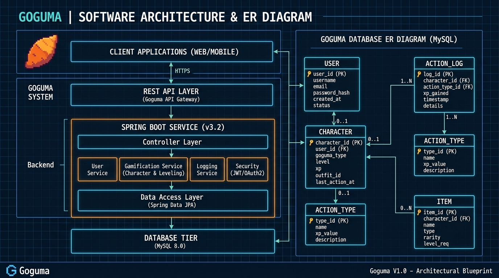
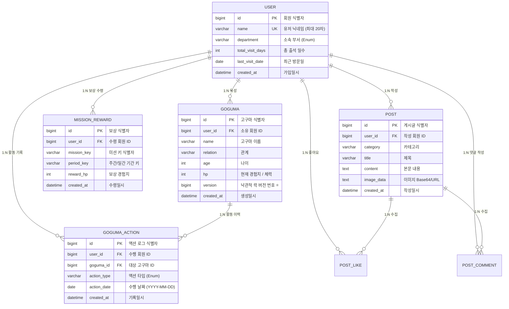

# 🍠 고구마 키우기 (Goguma Web) - Backend v2

> **"게이미피케이션 기반 가상 육성 서비스의 Spring Boot 3 & JPA 계층형 아키텍처 리팩토링"**

<p align="left">
  
  
  
  
  
  
</p>

---

## 🏛️ System Architecture & Blueprint



---

## 📌 1. 프로젝트 개요 & 리팩토링 배경 (v1 ➔ v2)

본 프로젝트는 기존에 빠르게 프로토타입으로 제작되었던 **Node.js (Express) + SQLite 기반의 단일 파일 모놀리식(`server.js` 1,440줄) 레거시 코드**를, 서비스 확장과 동시성 문제 해결을 위해 **Spring Boot 3 + JPA + MySQL 기반의 정석적인 계층형 아키텍처로 전면 마이그레이션 및 리팩토링**한 프로젝트입니다.

### 🔄 마이그레이션 비교 요약
| 구분 | v1 (Legacy) | v2 (Refactored) | 리팩토링 효과 |
| :--- | :--- | :--- | :--- |
| **Backend** | Node.js (Express) | **Java 17 / Spring Boot 3.2** | 타입 안정성 및 엔터프라이즈 환경 확장성 확보 |
| **구조** | 단일 파일(`server.js`) | **계층형 아키텍처 (Layered)** | Controller - Service - Repository 관심사 분리 |
| **데이터베이스** | SQLite (로컬 파일) | **MySQL 8.0 & H2 듀얼 프로파일** | 대용량 트랜잭션 및 인메모리 테스트 환경 지원 |
| **ORM/영속성** | 원시 SQL 직접 조작 | **Spring Data JPA** | 객체 지향 도메인 모델링 및 유지보수성 향상 |
| **동시성 제어** | 미적용 | **JPA `@Version` 낙관적 락(Optimistic Lock)** | 광클/중복 요청 시 경험치(HP) 정합성 완벽 보장 |

---

## 🗄️ 2. 데이터베이스 ERD (Entity Relationship Diagram)



---

## 📡 3. REST API 명세서

모든 API 응답은 통일된 규격(`ApiResponse<T>`)으로 반환됩니다:
```json
{
  "success": true,
  "data": { ... },
  "message": "요청이 성공적으로 처리되었습니다."
}
```

### 👤 User & Auth API
| HTTP Method | Endpoint | 설명 | Request Body / Param |
| :---: | :--- | :--- | :--- |
| `POST` | `/api/start` | 닉네임 기반 로그인/회원가입 및 세션 발급 | `{"name": "진호", "department": "언약부"}` |
| `GET` | `/api/me` | 현재 세션 로그인 유저 정보 조회 | Header (Session ID) |
| `POST` | `/api/logout` | 세션 무효화 및 로그아웃 | Header (Session ID) |

### 🍠 Goguma Domain API (핵심)
| HTTP Method | Endpoint | 설명 | Request Body / Param |
| :---: | :--- | :--- | :--- |
| `GET` | `/api/goguma` | 로그인 유저가 보유한 고구마 목록 조회 | Header (Session ID) |
| `POST` | `/api/goguma/add` | 새로운 고구마 캐릭터 등록 | `{"name": "호박이", "relation": "친구", "age": 25}` |
| `POST` | `/api/goguma/grow` | **성장/활동 수행 (동시성 제어 적용)** | `{"gogumaId": 1, "actionType": "contact"}` |
| `GET` | `/api/goguma/{id}/history`| 고구마별 활동 누적 히스토리 조회 | Path: `id` (고구마 ID) |
| `POST` | `/api/goguma/remove` | 고구마 삭제 | `{"id": 1}` |

#### 💡 액션 타입 및 경험치 가중치 명세
* `postWrite` (+1 HP): 게시판 글 작성
* `bible` (+1 HP): 말씀 읽기
* `prayer` (+1 HP): 기도 부탁하기
* `contact` (+2 HP): 연락 및 오프라인 만남
* `invite` (+8 HP): 권유 및 전도하기

---

## 🛠️ 4. 기술적 의사결정 및 트러블슈팅 (면접 핵심 포인트)

### 1) '성장(Grow)' 요청에 대한 동시성 이슈 및 낙관적 락(Optimistic Lock) 해결
* **문제 상황:** 사용자가 네트워크 지연 상태에서 '물주기/성장' 버튼을 빠르게 연속 클릭할 경우, 이전 트랜잭션이 커밋되기 전에 새 트랜잭션이 조회하여 고구마의 경험치(HP)가 중복 누락되거나 정합성이 깨질 위험 발생.
* **해결 방법:**
  * DB 전체에 락을 거는 비관적 락(Pessimistic Lock)은 처리량이 떨어지므로, 충돌 빈도가 상대적으로 낮은 웹 환경 특성을 고려하여 **JPA의 `@Version`을 이용한 낙관적 락** 도입.
  * 동시에 커밋 시도 시 `ObjectOptimisticLockingFailureException`을 감지하여 안전하게 롤백하고 재시도 유도.
* **결과:** 급격한 중복 트랜잭션 발생 시에도 데이터 정합성을 100% 보장.

### 2) 하루 1회 액션 제한: 복합 유니크 제약(Unique Constraint)과 2단계 검증
* **문제 상황:** 사용자가 동일한 날짜에 같은 액션(예: 기도하기)을 다중 탭에서 동시에 실행할 경우 중복 기록이 생성될 수 있음.
* **해결 방법:**
  1. 애플리케이션 계층: `existsByUserIdAndGogumaIdAndActionTypeAndActionDate(...)` 사전 조회 검증
  2. 데이터베이스 계층: `(user_id, goguma_id, action_type, action_date)` 복합 유니크 인덱스 설정
* **결과:** 레이스 컨디션 환경에서도 데이터베이스 레벨에서 원천적으로 중복 삽입 차단.

### 3) 전역 예외 처리 규격화 (`@RestControllerAdvice`)
* 비즈니스 예외(`BusinessException`)와 입력 유효성 검증 실패(`MethodArgumentNotValidException`)를 분리하여 프론트엔드가 명확한 에러 코드와 사용자 친화적 메시지를 수신하도록 표준화.

---

## 🚀 5. Getting Started (실행 방법)

### 요구사항
* Java 17+
* Gradle 8+

### 실행 커맨드
```bash
# 1. 저장소 클론
git clone https://github.com/1928704-afk/gugu.git

# 2. 백엔드 폴더 이동
cd goguma-backend

# 3. 로컬 프로파일(H2 In-Memory)로 실행
./gradlew bootRun

# 서버 기동 포트: http://localhost:8080
# H2 콘솔 접속: http://localhost:8080/h2-console (JDBC URL: jdbc:h2:mem:gogumadb)
```
