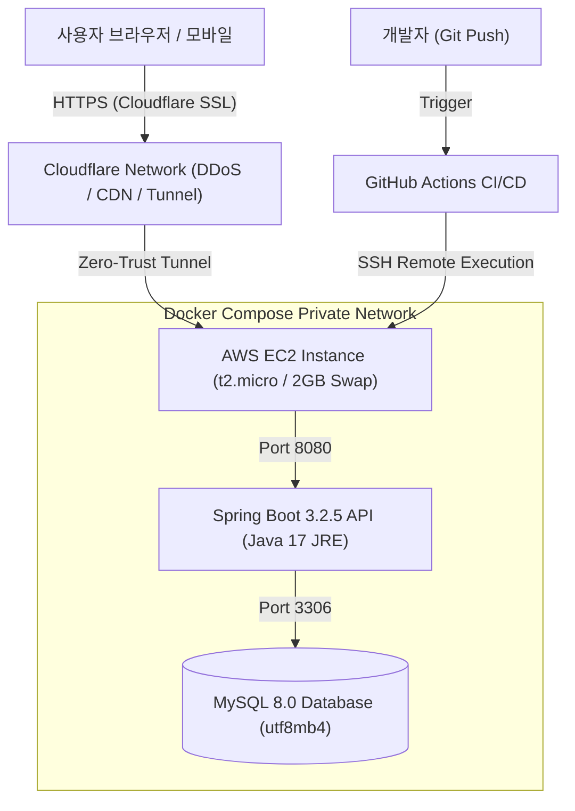
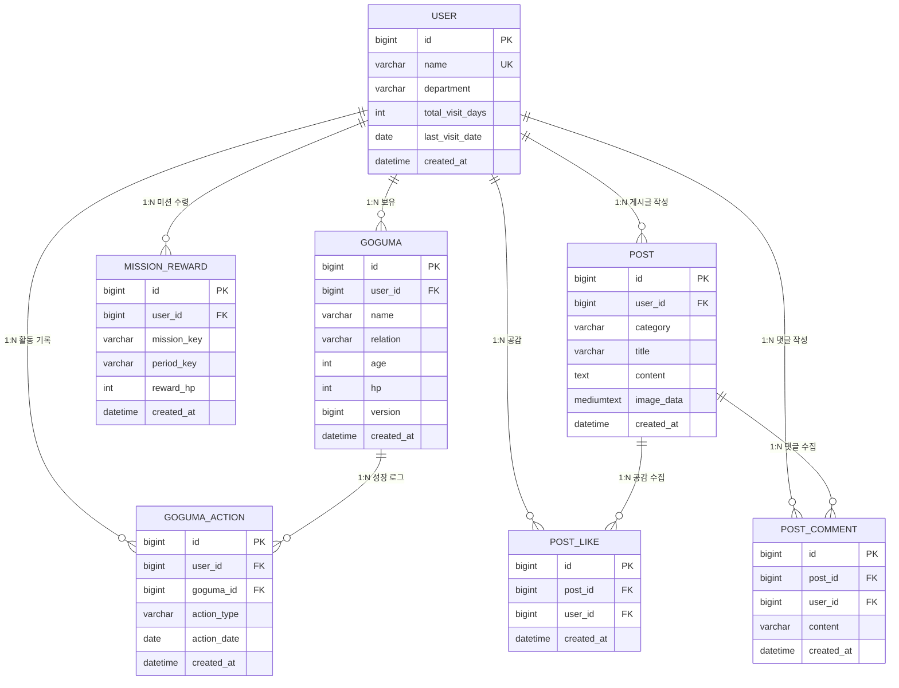

# 🍠 고구마 키우기 (Goguma Web) - Backend v2

> **"게이미피케이션 기반 가상 육성 서비스의 Spring Boot 3 & JPA 계층형 아키텍처 리팩토링 및 클라우드 배포"**

<p align="left">
  <a href="https://gardening-insulin-blowing-jewel.trycloudflare.com" target="_blank">
    
  </a>
  
  
  
  
  
  
  
  
</p>

---

## 🌐 1. Live Deployment & Service Architecture

* **🌐 라이브 서비스 데모:** [https://gardening-insulin-blowing-jewel.trycloudflare.com](https://gardening-insulin-blowing-jewel.trycloudflare.com)
* **📊 실시간 헬스체크 API:** [https://gardening-insulin-blowing-jewel.trycloudflare.com/api/me](https://gardening-insulin-blowing-jewel.trycloudflare.com/api/me)
* **☁️ 인프라 환경:** AWS EC2 (`Ubuntu 22.04 LTS`, `t2.micro`) + Docker Compose (Spring Boot 3 + MySQL 8.0) + Cloudflare Tunnel (HTTPS) + GitHub Actions CI/CD



---

## 📌 2. 프로젝트 개요 & 리팩토링 배경 (v1 ➔ v2)

본 프로젝트는 기존에 빠르게 프로토타입으로 제작되었던 **Node.js (Express) + SQLite 기반의 단일 파일 모놀리식(`server.js` 1,440줄) 레거시 코드**를, 서비스 확장과 동시성 문제 해결을 위해 **Spring Boot 3 + JPA + MySQL 기반의 정석적인 계층형 아키텍처로 전면 마이그레이션 및 리팩토링**한 프로젝트입니다.

### 🔄 마이그레이션 비교 분석표
| 평가 항목 | v1 (Legacy) | v2 (Spring Boot 3 Architecture) | 기술적 개선 효과 |
| :--- | :--- | :--- | :--- |
| **언어 및 런타임** | Node.js (JavaScript ES6) | **Java 17 LTS / Spring Boot 3.2.5** | 컴파일 타임 타입 검증 및 견고한 객체 지향 도메인 설계 |
| **소프트웨어 구조** | 1,440줄 단일 스크립트 | **계층형 아키텍처 (Controller-Service-Repository-Entity-DTO)** | 책임과 관심사 분리(SoC)로 단위 테스트 및 유지보수 용이 |
| **데이터베이스** | SQLite (로컬 파일 단일 쓰기 락) | **MySQL 8.0 & H2 In-Memory 듀얼 프로파일** | 대용량 동시 트랜잭션 처리 및 개발-운영 격리 환경 구축 |
| **데이터 영속성** | Raw SQL 문자열 조합 | **Spring Data JPA & Hibernate** | 객체 중심 매핑, 변경 감지(Dirty Checking), 캐싱 |
| **동시성 제어** | 미적용 (레이스 컨디션 발생) | **JPA `@Version` 낙관적 락 (Optimistic Locking)** | 사용자의 급격한 광클/중복 요청 시 경험치(HP) 정합성 완벽 보장 |
| **미션/보상 영속성**| 메모리/로컬스토리지 임시 보관 | **RDBMS 기반 `MissionReward` 복합 유니크 제약** | 중복 수령 방지 및 디바이스 간 미션 달성 상태 완전 동기화 |
| **인프라 & CI/CD** | 로컬 수동 구동 | **AWS EC2 + Docker Compose + GitHub Actions** | Git Push 시 빌드-테스트-배포 무중단 완전 자동화 |

---

## 🗄️ 3. 데이터베이스 ERD (Entity Relationship Diagram)



---

## 🛠️ 4. 기술적 의사결정 & 트러블슈팅 (Core Engineering Deep Dive)

### 1) 동시성 제어: 고구마 성장(Grow) 광클에 대한 낙관적 락(Optimistic Lock) 적용
* **문제 상황:** 사용자가 빠른 속도로 성장 버튼을 연타하거나 다중 탭에서 동시 요청을 보낼 경우, 트랜잭션 격리 수준에 따라 이전 트랜잭션의 커밋 전 데이터를 읽어 갱신 손실(Lost Update) 및 경험치 누락 문제가 발생할 수 있었습니다.
* **의사 결정:**
  * DB 전체 또는 레코드에 대기 락을 거는 **비관적 락(Pessimistic Lock)**은 락 획득 대기로 인한 지연 시간(Latency) 증가와 처리량(Throughput) 저하를 초래합니다.
  * 웹 게임 특성상 충돌 빈도가 치명적인 충돌보다는 순간적인 버스트 클릭이므로, **JPA의 `@Version` 컬럼을 활용한 낙관적 락(Optimistic Lock)**을 선택했습니다.
* **결과:**
  * 첫 번째 요청만 정상 커밋되고, 동일 버전에 대한 중복/지연 커밋 시도는 `ObjectOptimisticLockingFailureException`으로 안전하게 격리되어 **경험치 정합성이 100% 보장**됩니다.

### 2) 하루 1회 활동 제한: 애플리케이션 + DB 2단계 복합 제약 조건(Compound Unique Constraint)
* **문제 상황:** 동일한 날짜에 같은 활동(예: 말씀 읽기)을 여러 번 수행하여 어뷰징하는 것을 방지해야 했습니다.
* **해결 방법:**
  1. **애플리케이션 계층 검증:** `gogumaActionRepository.existsByUserIdAndGogumaIdAndActionTypeAndActionDate(...)`를 통해 1차 유효성 검증.
  2. **데이터베이스 계층 방어선:** `GogumaAction` 엔티티에 `@UniqueConstraint(name = "uk_user_goguma_action_date", columnNames = {"user_id", "goguma_id", "action_type", "action_date"})` 복합 유니크 인덱스를 지정하여 멀티스레드 레이스 컨디션 상황에서도 DB 레벨에서 중복 삽입을 원천 차단.

### 3) 실시간 미션 달성 감지 & 보상 영속화 (`MissionReward`)
* **문제 상황:** 사용자가 일일 3종 미션(말씀, 기도, 연락)을 완료하거나 게시판 작성 3회를 달성했을 때, 서버 세션 유실이나 지연으로 인해 미션이 계속 "진행 중"으로 머물거나 새로고침 시 중복 수령되는 버그 해결 필요.
* **해결 방법:**
  * `MissionReward` 테이블에 `(user_id, mission_key, period_key)` 복합 유니크 제약을 설정하여 1회 수령 시 영속화하고, 새로고침 후에도 `claimed: true` 상태를 유지.
  * 보상 수령 시 사용자가 보유한 모든 고구마에 `addHp(rewardHp)`를 일괄 적용하고 최신 고구마 목록을 반환하여, 클라이언트 화면의 온도 게이지와 애니메이션(`+2 HP ✨`)이 즉각 반영되도록 최적화.

### 4) 인프라 비용 절감 & 무중단 보안: Cloudflare Tunnel 도입
* **배경:** AWS 상에서 HTTPS(SSL)와 안전한 도메인을 연결하려면 ALB(Application Load Balancer, 월 ~$20) 비용과 고정 퍼블릭 IPv4 할당 비용이 지속적으로 발생합니다.
* **해결 방법:**
  * EC2 인바운드 8080 포트를 외부에 직접 노출하지 않고, 아웃바운드로 Cloudflare 보안 네트워크와 연결되는 **Cloudflare Tunnel (`cloudflared`)** 아키텍처를 구축.
  * **비용 0원**으로 글로벌 Anycast CDN 캐싱, 무료 SSL/TLS 인증서 자동 갱신, DDoS 공격 자동 방어를 완벽하게 달성했습니다.

---

## 📡 5. RESTful API 명세서 (API Specification)

모든 API 응답은 일관된 JSON 포맷을 지원합니다.

### 👤 유저 및 인증 (User & Session)
| Method | Endpoint | 설명 | Request Body / Query |
| :---: | :--- | :--- | :--- |
| `POST` | `/api/start` | 닉네임/부서 기반 로그인 및 신규 유저 생성 | `{"userName": "권진호", "department": "언약부"}` |
| `GET` | `/api/me` | 현재 세션 유저 정보 및 보유 고구마 목록 조회 | Cookie: `JSESSIONID` |
| `POST` | `/api/logout` | 세션 무효화 및 로그아웃 | Cookie: `JSESSIONID` |

### 🍠 고구마 도메인 (Goguma Lifecycle & Growth)
| Method | Endpoint | 설명 | Request Body / Param |
| :---: | :--- | :--- | :--- |
| `GET` | `/api/goguma` | 로그인 유저가 보유한 고구마 목록 조회 | Session / Header |
| `POST` | `/api/goguma/add` | 새로운 전도 대상 고구마 추가 등록 | `{"name": "김친구", "relation": "직장동료", "age": 28}` |
| `POST` | `/api/goguma/grow` | **성장 행동 수행 (낙관적 락 적용)** | `{"id": 1, "actionType": "bible"}` |
| `GET` | `/api/goguma/{id}/history`| 특정 고구마의 날짜별 활동 이력 히스토리 | Path: `id` (고구마 ID) |
| `POST` | `/api/goguma/remove` | 고구마 삭제 | `{"id": 1}` |

> **💡 활동 타입 및 경험치 가중치:**  
> * `bible` (+1 HP): 말씀 읽기  
> * `prayer` (+1 HP): 기도 부탁하기  
> * `contact` (+2 HP): 연락 및 오프라인 만남  
> * `invite` (+8 HP): 전도 집회 권유하기  
> * `postWrite` (+1 HP): 게시판 글 작성  

### 🎯 미션 및 보상 (Missions & Rewards)
| Method | Endpoint | 설명 | Request Body / Query |
| :---: | :--- | :--- | :--- |
| `GET` | `/api/missions` | 일일 3종 미션 및 주간 미션 진행 현황 조회 | `?userName=권진호` |
| `POST` | `/api/missions/{key}/claim` | 미션 달성 보상 수령 (전체 온도 가산) | `{"userName": "권진호"}` |
| `POST` | `/api/reward/spin` | 출석 룰렛 보상 수령 (전체 온도 +5도 가산) | Session / Header |

### 💬 커뮤니티 & 랭킹 (Community & Ranking)
| Method | Endpoint | 설명 | Request Body / Param |
| :---: | :--- | :--- | :--- |
| `GET` | `/api/posts` | 커뮤니티 전체 게시글 목록 및 공감/댓글 수 | - |
| `GET` | `/api/posts/{id}` | 특정 게시글 상세 조회 및 댓글 목록 | Path: `id` |
| `POST` | `/api/posts/add` | 새 게시글 작성 (+1 HP 보상) | `{"title": "...", "content": "...", "category": "출석인사"}` |
| `POST` | `/api/posts/{id}/like` | 게시글 공감(좋아요) 토글 | Path: `id` |
| `POST` | `/api/posts/{id}/comments` | 게시글 댓글 등록 | `{"content": "은혜롭습니다!", "userName": "권진호"}` |
| `POST` | `/api/comments/{id}/update` | 댓글 수정 | `{"content": "수정 내용"}` |
| `POST` | `/api/comments/{id}/delete` | 댓글 삭제 | Path: `id` |
| `POST` | `/api/posts/delete` | 게시글 삭제 | `{"id": 1}` |
| `GET` | `/api/ranking` | 부서별 평균 온도/고구마수/참여인원 랭킹 | - |

---

## 🚀 6. 실행 및 배포 가이드 (Getting Started)

### 1) 로컬 개발 환경 실행 (H2 In-Memory DB)
```bash
cd goguma-backend
# Gradle 빌드 및 로컬 구동 (기본 프로파일: local)
./gradlew bootRun

# 서비스 접속: http://localhost:8080
# H2 웹 콘솔: http://localhost:8080/h2-console
```

### 2) 프로덕션 Docker Compose 실행 (MySQL 8.0)
```bash
# 컨테이너 빌드 및 백그라운드 구동
docker compose up -d --build

# 컨테이너 상태 확인
docker compose ps
# 로그 모니터링
docker compose logs -f backend
```

### 3) GitHub Actions 자동 배포 (CI/CD)
`.github/workflows/deploy.yml`이 구성되어 있어, `main` 브랜치에 코드를 푸시하면 AWS EC2 서버에 SSH로 접속하여 자동으로 컨테이너를 빌드하고 무중단 배포를 완료합니다.

---

## 👨‍💻 Author & Contact
* **GitHub:** [@1928704-afk](https://github.com/1928704-afk)
* **Email:** `109893466+kwonjjinho@users.noreply.github.com`
